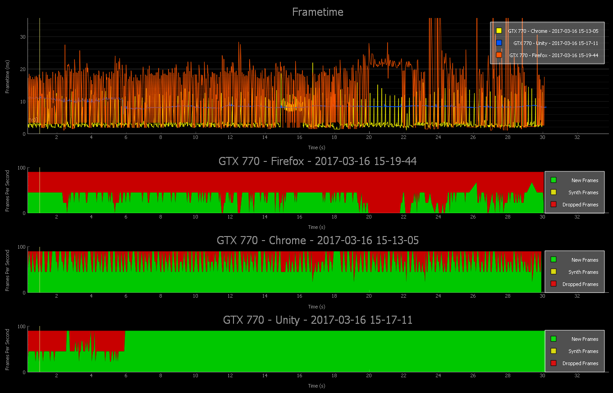
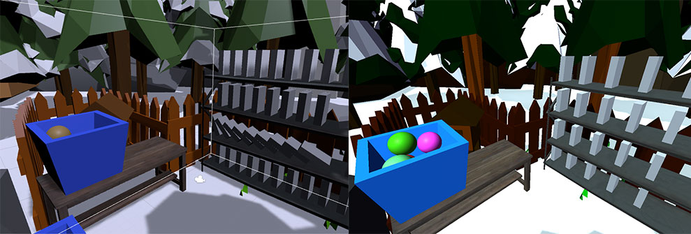
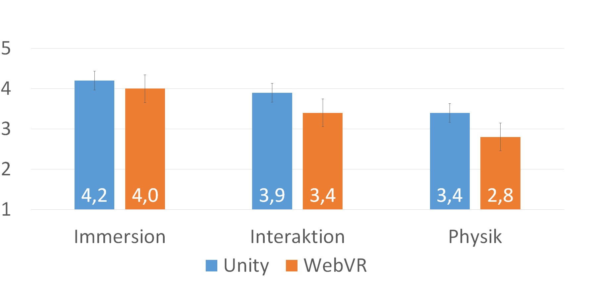
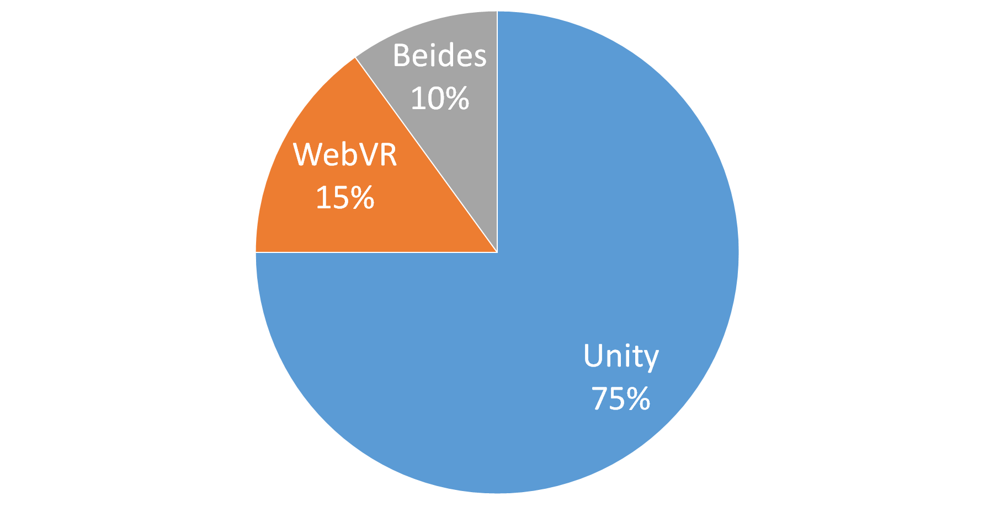

<!-- .slide: data-background="linear-gradient(rgba(0, 0, 0, 0.3), rgba(0, 0, 0, 0.3)), url(media/img/beuth.png)" data-background-size="cover" -->

  <h1>Masterarbeit Verteidigung</h1>
  
Konzeption, Entwicklung und Evaluation einer
     interaktiven Virtual Reality Anwendungen mit
     Web-Technologien im Vergleich zu nativer Entwicklung

  

    Sebastian Kasanzew | Beuth Hochschule | iconmobile
  

<!-- NOTES -->

- Titel vorlesen

------

# Ziele

- Vergleich zwischen WebVR und nativen VR-Apps
- Entwicklung einer Test-App für beide Plattformen
- Evaluation der Ergebnisse der Test-App durch Usertests
- Prototyp einer Sägen-Simulation in VR 

<!-- NOTES -->

- Ziel dieser Arbeit ist ein objektiver Vergleich von WebVR und nativen VR-Apps
- Dazu wurde eine Test-App für beide Plattformen entwickelt
- Die im Anschluss durch Usertests evaluiert wurde
- Darauf basierend wurde ein Prototyp für die geeignetste Plattform entwickelt

------

## Entwickler Plattformen

<!-- .slide: data-transition="slide-in none" -->

    
&nbsp;&nbsp;&nbsp;

    
native Engines

    

    

    

<!-- NOTES -->
- Für native Entwicklung ist man auf proprietäre Engines quasi angewiesen
- Hier einige Beispiele für freiverfügbare Engines

---

## Entwickler Plattformen

<!-- .slide: data-transition="none slide-out" -->

    
&nbsp;&nbsp;&nbsp;

    
native Engines

        

        

        

    
&nbsp;&nbsp;&nbsp;

    
WebVR

    

        <h2 style="margin-left: 280px">**das Web**</h2>
    

    
HTML

    
JavaScript

    
WebGL

<!-- NOTES -->
- WebVR basiert nur auf Web-Technologien
- Keine proprietäre Software bei Web-Entwicklung

---

## Gewählte Plattformen/Frameworks   zum Vergleich

    

    

<!-- NOTES -->
- Für den Vergleich wurde Unity gewählt, da ich damit schon Erfahrungen gesammelt habe
- Als Web-Framework wird alternativlos A-Frame benutzt

------

# Bewertung

<!-- NOTES -->

- unterteilt in technische Kriterien welche eher das Endprodukt beeinflussen
- und allgemeine Kriterien, die die Entwicklung maßgeblich mitbestimmen

---

# Technische Kriterien

- Hardware
- Grafik-API
- Multimedia
- Lizensierung
- Performance

<!-- NOTES -->

- Hardware: Kompatibilität mit aktueller Hardware
- Grafik-API: Möglichkeiten der gegebenen Grafikschnittstellen
- Multimedia: Unterstützung von verschiedenen Formaten (3D/Bild/Video)
- Lizensierung: Lizensmodell für Vertrieb
- Performance: Anzahl/Komplexität dargestellter Elemente bei stabiler FPS

---

# Allgemeine Kriterien

- Dokumentation
- Community
- Verbreitung
- Implementierungsaufwand
- Paketmanager
- Wiederverwertbarkeit

<!-- NOTES -->

- Dokumentation: Umfang und Qualität der Dokumentation
- Community: Größe und Aktivität
- Verbreitung: Anzahl vertriebener Apps
- Implementierungsaufwand: Zeit der Entwicklung am Beispiel der Test-App
- Paketmanager: Anzahl und Qualität angebotener Pakete
- Wiederverwertbarkeit: Portierbarkeit von Code zwischen Projekten

------

# Technische Kriterien

<!-- NOTES -->
- Ausschlaggebend für das Endergebnis, wie es bei Nutzern ankommt

---

# Hardware

  

  

  

  

  

  

<!-- NOTES -->
- Wird von großen Unternehmen weltweit investiert
- Hardware reicht von billig bis teuer, mit und ohne Kabel, Controller, verschiedene Tracking Technologien
- Die HTC Vive bietet mit Steam derzeit das umfangreichste Erlebnis auf dem freien Markt
- Es gibt also eine große Anzahl an Geräten, Systemen und Plattformen, die in Konkurenz zu einander stehen

- Unity VR Projekte können für jede dieser Plattformen kompiliert werden
- A-Frame auch, außer PS (kein WebGL im PS Browser)

---

https://webvr.rocks

  

    
    <i>Firefox Nightly</i>
  

  

    
    <i>Microsoft Edge</i>
  

  

    
    <i>Chromium</i>
  

  

    
    <i>Chrome for Android</i>
  

  

    
    <i>Oculus Carmel</i>
  

  

    
    <i>Samsung Internet</i>
  

  

    
    <i>Mobile Polyfill</i>
  

<!-- NOTES -->
- Edge: nur Windows Mixed Reality Plattform
- Firefox und Chrome Desktop nur auf Windows für Vive und Oculus
- Firefox + Chrome WebVR 1.0 wird 2017 in die normalen Releases gebracht
- Mobile Polyfill: Nutzt die Gerätesensoren / Orientierungs Sensoren um auf Smartphones VR zu ermöglichen

---

# Grafik-API

<table>
  <tr>
    <th>A-Frame</th>
    <th>Unity</th>
  </tr>
  <tr>
    <td>WebGL 1.0 (~OpenGLES 2.0)</td>
    <td>DirectX 9-12</td>
  </tr>
  <tr>
    <td>[WebGL 2.0 (~OpenGLES 3)]</td>
    <td>OpenGLCore</td>
  </tr>
  <tr>
    <td></td>
    <td>OpenGLES 2-3</td>
  </tr>
  <tr>
    <td></td>
    <td>Metal</td>
  </tr>
  <tr>
    <td></td>
    <td>Vulkan </td>
  </tr>
</table>

<!-- NOTES -->
- WebGL 1.0 auf fast allen Geräten darstellbar
   - doch nur kleinster gemeinsamer Nenner
- Unity unterstützt alle aktuellen Grafik APIs
   - für Windows, Mac, und mobile
   - demnächst Unterstützung für WebVR

---

<!-- .slide: data-background="media/img/apainter.gif" -->

# A-Frame: *A-Painter*

@mozillavr

<!-- NOTES -->
- Tilt-Brush Klon von Mozilla
- visueller Stil eher durchweg vereinfacht wegen Performance Beschränkung

---

<!-- .slide: data-background-video="media/video/Star_Trek_Bridge_Crew.mp4" data-background-video-loop="true" data-background-video-muted="true" data-state="state--bg-dark" -->

# Unity:  *Star Trek:Bridge Crew*

@Ubisoft

https://youtu.be/p_Rz_btMLR4

<!-- NOTES -->
- (Folienhelfer ausschalten)
- deutlich hochwertiger und ansehnlicher

---

# Multimedia

<table>
  <tr>
    <th></th>
    <th>A-Frame</th>
    <th>Unity</th>
  </tr>
  <tr>
    <td rowspan="2">3D</td>
    <td>COLLADA, OBJ, JSON, Blend, glTF</td>
    <td>FBX, COLLADA, OBJ, </td>
  </tr>
  <tr>
    <td></td>
    <td>MAX, C4D, Maya, ...</td>
  </tr>
  <tr>
    <td>Bilder</td>
    <td>JPG, PNG, BMP, GIF, SVG</td>
    <td>JPG, PNG, BMP, TGA, TIF, PSD</td>
  </tr>
  <tr>
    <td>Videos</td>
    <td>Browserabhängig</td>
    <td>alle von Browsern unterstützen Formate</td>
  </tr>
</table>

<!-- NOTES -->
- Spezielle 3D-Formate für Web
- Unity: unterstützt proprietäre Formate, falls Software installiert
- besserer Support seitens Unity für Videos und Bilder
- da bei Browsern abhängig vom Hersteller

---

# Lizensierung

<table>
  <tr>
    <th>&nbsp;</th>
    <th>A-Frame</th>
    <th>Unity</th>
  </tr>
  <tr>
    <td>&nbsp;</td>
    <td>Open Source (MIT)</td>
    <td>Closed Source</td>
  </tr>
  <tr>
    <td>&nbsp;</td>
    <td></td>
    <td>Lizenz abhängig von Umsatz und Unternehmensgröße</td>
  </tr>
</table>

<!-- NOTES -->
- Sobald ein Projekt kommerziell wird, müssen Lizensgebühren beachtet werden
- Bei A-Frame keine Bedenken
- Bei Unity abhängig von...
   - Code nicht einsehbar (was auch nicht nötig ist)

---

# Performance

<!-- NOTES -->
- Stand März 2017 mit eigener Testszene
- Frametime: Zeit zum Render und Senden eines Frames
- Vergleich zwischen Firefox Nightly, Chromium VR
   - Firefox nie 90FPS
   - ...
- Browserabhängig

------

# Allgemeine Kriterien

<!-- NOTES -->
die den Entwicklungsprozess einer App maßgeblich mitbestimmen

---

# Dokumentation

  

    
    <i>A-Frame</i>
  

  

    
    <i>Unity</i>
  

<!-- NOTES -->

- A-Frame hat eine sehr vollständige, versionierte Doku
- Neu: A-Frame scholar bietet eine Plattform zum Austausch und Tutorials
 
- Unity hat jedoch all das, aber in viel größerem Umfang (mehrsprachig)
- auch durch die höhere Komplexität und Funktionsumfang

---

<!-- .slide: data-background="media/img/header.png" -->

# Community

- aktive Community auf beiden Seiten
- Unitys Community älter

<!-- NOTES -->

---

# Implementierungsaufwand

  

| A-Frame     | Unity      |
|-------------|------------|
| ~90 Stunden | 35 Stunden |

<!-- NOTES -->
- Allein Programmierzeit gemessen
- Asset Erstellung, Recherche und Konzeption nicht einberechnet
- Overhead bei A-Frame durch noch inkompatible Versionen (0.3.0, 0.4.0)
- Durch nicht abwärtskompatible Änderungen an A-Frame bis v1.0.0
+ Nutzung des React Frameworks zusammen mit A-Frame erzeugte zusätzlichen Aufwand

---

# Paketmanager

| A-Frame                       | Unity                     |
|-------------------------------|---------------------------|
| 350 000 npm Pakete            | 15 000 Pakete             |
| **100+** speziell für A-Frame | **1000+** speziell für VR |

<!-- NOTES -->
- Open source
- Meiste Arbeit auf GitHub
- 15 000 Pakete schließt kostenpflichtige mit ein

---

# Wiederverwertbarkeit

| A-Frame                          | Unity                        |
|----------------------------------|------------------------------|
| Einfache Trennung in npm Pakete  | Modularer Code möglich       |
| Simples Updaten von Paketen      | Umstände bei Paket Update    |
| Versionsabhängigkeiten vorhanden | Keine Versionsabhängigkeiten |

<!-- NOTES -->
- Web-Projekte lassen sich einfach trennen mit NPM
- bei Unity auch möglich (erforderlich durch Asset Store)
- Problem z.B. bei SteamVR Update
  - alter Ordner wird einfach überschrieben -> gelöschte Dateien bleiben als Leichen
- (Unity) PaketA v1.0 erfordert PaketB v0.3 nicht möglich

------

# Ergebnis

<!-- .slide: data-background-color="#fff" -->

<!-- NOTES -->
- A-Frame nur bei Lizensierung und Wiederverwertbarkeit klar im Vorteil
- In Punkto Hardware herrscht Gleichstand
- In allen anderen Bereichen hat Unity die Nase vorn 

---

## User Tests

mit 20 Teilnehmern

<!-- NOTES -->
- Testablauf in zwei nahezu identischen Szenen
- links Unity, rechts A-Frame
- Farben, Licht und Schatten werden intern unterschiedlich berechnet. Werte sind identisch.
- Schatten bei Unity sind dynamisch
- bei A-Frame gebacken und dynamisch für inter. Objekte (niedrige Auflösung)

---

## A-Frame App

<!--

-->
<iframe width="800" height="500" src="http://webvr.kasanzew.de"></iframe>

<!-- NOTES -->
- Das ist die von mir erstellte A-Frame App, die innerhalb der Folie läuft 
- Funktioniert auf Desktops, Android, iOS, Samsung Gear VR, Oculus Rift und HTC Vive
- Kann Werte im DOM live editieren ("bucket": 0 -4.2 0)
- Da es nur HTML ist...

---

## Bewertung

<!-- .slide: data-background-color="#fff" -->

A

<!-- NOTES -->
- Immersion: nahezu gleich, da bei beidem HTC Vive... Controller tracking Probleme bei A-Frame
- Interaktion: Greifen von Objekten geschah bei Unity merklich schneller
- Physik war bei Unity realistischer

---

## Gesamteindruck

<!-- .slide: data-background-color="#fff" -->

<!-- NOTES -->
- klarer Gewinner des Vergleichs ist Unity

------

# Sägen-Prototyp

            

<!-- .slide: data-background-video="media/video/saw.mp4" data-background-video-loop="true" data-state="state--bg-dark" -->

<!-- NOTES -->
- Der Prototyp für die Sägen-Simulation wurde anschließend mit Unity erstellt
- Ausschlaggebend war eine fehlende Komponente für physikalisch korrekte Gelenke/Scharniere
- gibt es mitlerweile aber auch schon
- die A-Frame Community ist sehr schnellebig

---

# Zusammenfassung

---

## Probleme von VR-Ökosystemen

  

    
    <i>Wächter</i>
  

  

    
    <i>Installationen</i>
  

  

    
    <i>Geschlossen</i>
  

<!-- NOTES -->
- App stores und Unternehmen kontrollieren den Vertrieb: können Inhalte entfernen oder sperren
- Downloads / Installationen sind Barieren für den Konsum: schlecht für kleine Unternehmen
- Geschlossenes Ökosystem: drittanbieter engines, flache Lernkurven, gekapselte Erfahrungen, Fragmentierung

- Wenn man diese Punkte umgehen will, ist WebVR die Lösung

---

## WebVR

Eine offene VR-Plattform mit den Vorteilen des **Web**

  

    
    <i>Offen</i>
  

  

    
    <i>Verbunden</i>
  

  

    
    <i>Sofort</i>
  

<!-- NOTES -->
VR im Browser bringt die Vorteile des Internets mit sich

Offen:
- Jeder kann veröffentlichen
- Open source Kultur mit offenen Standards

Verbunden:
- VR Welten bereisen, wie Webseiten
- seit 29.06 Vorschau durch Portale

Sofort:
- Klick einen Link auf Twitter oder Facebook, sofortiges VR Erlebnis
- Keine Installationen
- Vorteilhaft für Shopping und ähnliche Bereiche

---

<!-- .slide: data-background="media/img/Unity-Adam.jpg" data-state="state--bg-dark" -->

# Unity

- Performance
- Visuelle Qualität
- einfache Monetarisierung

<!-- NOTES -->
- Wenn performancekritische Maßstäbe erreicht
- Visuelle Qualität im Vordergrund steht
- und Vertrieb über Drittanbieter das Ziel ist

------

# Vielen Dank
### für die Aufmerksamkeit

------

# Quellen

- https://aframevr.github.io/aframe-presentation-kit/
- Quellen im Literaturverzeichnis der Masterarbeit
